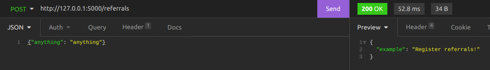

<<<<<<< HEAD
# SQLAlchemy / Flask / MySQL  

##What is This?

This is a simple code made in Python with the intention to create an API that integrates 
**SQLAlchemy** with **Flask** and **MySQL DB**. 

##What can be done with the API?

1. Register Teams `(POST /teams)`
2. Register Employees and allow to add them to a given Team `(POST /employees)`
3. Register Recommendations `(POST /recommendations)`
4. Return a list of Teams and respective Employees `(GET /teams)`
5. Return a list of Recommendations `(GET /recommendations)`
6. Return a list containing which Employees made which Recommendations `(GET /recommendations/employees)`


##How to run this? 

Para rodar o servidor execute o comando abaixo no terminal dentro da pasta raíz do projeto:
```
python3 main.py
```
A seguinte mensagem deve aparecer:
```
Running on http://127.0.0.1:5000/ (Press CTRL+C to quit)
```

Pronto, sua API está rodando no endereço `http://127.0.0.1:5000/`. Utilizando o Insomnia ou a sua
ferramenta de preferência você pode fazer requisições nos endpoins:


Agora, a partir do código inicial da API, desenvolva seu sistema. A modelagem do banco de
dados faz parte da solução que deve ser entregue, sendo assim você tem liberdade de escolher as 
tabelas que serão criadas.


**Atenção**: O objetivo não é aprender Flask, o Flask está sendo utilizado apenas para que
o desafio fique o mais simples e objetivo possível. Não é uma tecnologia utilizada na Simbiose.
=======
# sqlalchemy_flask_api
SQL Alchemy Flask API
>>>>>>> 7aa8cac6f73ab815f3f608b413f66c4bc4d4201a
