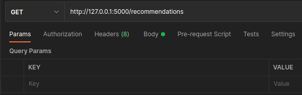

# SQLAlchemy / Flask / SQLite

## What is This?

This is a simple code made in Python with the intention to create an API that integrates 
**SQLAlchemy** with **Flask** and **SQLite DB**. 

## Dependencies

All dependencies are described in Pipfile 

## What can the API do?

1. Register Teams `(POST /teams)`
2. Register Employees and allow to add them to a given Team `(POST /employees)`
3. Register Recommendations `(POST /recommendations)`
4. Return a list of Teams and respective Employees `(GET /teams)`
5. Return a list of Recommendations `(GET /recommendations)`
6. Return a list containing which Employees made which Recommendations `(GET /recommendations/employees)`


## How to run this? 

Switch to folder **main_files** and run the following
```
python3 main.py
```
The following message shall show up
```
Running on http://127.0.0.1:5000/ (Press CTRL+C to quit)
```

Use **Postman** or **Insomnia** to make requests towards the endpoints


 |  <a href="https://www.linkedin.com/in/sambiase" target="_blank"></a> 